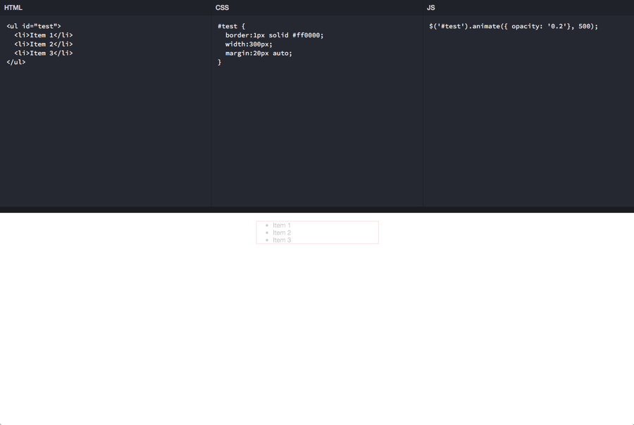

# evo-code-playground

##Summary
A dependency free representation of the code playground.

##Setup

* HTML
    * Copy everything inside the body tags from index.html
    * Paste that into the html of the page.

* CSS
    * Include the stylesheets referenced in index.html (index.css, normalize.css) in the head of the page.
    * Set the correct pathways to the referenced stylesheets
    * To change the default size of the top row, edit the class combo in index.css (.playground .boxes .box-edit { ) or the .box-edit class in the scss file

* Javascript
    * Include the javascript file referenced in index.html (evo-playground.js) in a script tag on the page.
    * Set the correct pathway to the referenced javascript file.


##Structure

####index.html
>The landing page for the application.

####frame.html
>The purpose of the frame.html is to demonstrate how the playground could be contained and shared on an third-party website.

The following example demonstrates, through a variable, how we could pass a source reference so the system can determine which CSS, JS, and HTML files should be loaded.

In the following example, we're passing 'tbl' as the source.

```html
<iframe src="./index.html?src=tbl" width="100%" height="750"></iframe>
```

####css directory
>Holds the style sheets for the application.
````shell
css/index.css
css/index.scss
css/normalize.css
````

####js directory
>Holds the javascript file for the application.
````shell
js/evo-playground.js
````
####src directory
>Holds ths source files for the html, css, and js rendered inside the editor boxes.
````shell
/css/index.css
/html/index.html
/js/index.txt
````

##

